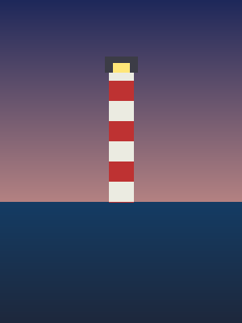

There is a lamp at the end of the pier that nobody remembers installing. It comes on at dusk, and the harbor feels different once it does.

## Section header

The picture above is stored next to this entry and linked with a relative path. The site finds it, reads its size, and publishes it beside the page.
